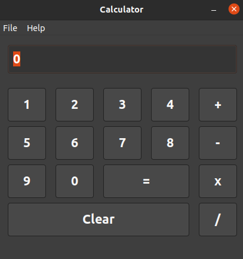

# LINUX C++ CALCULATOR

- A simple calculator built with C++ and wxWidgets, this a native build with theme dark mode.
- The aim of this project is to develop a more advanced calculator implementing ADTs(Abstract Data    Types) in C++

